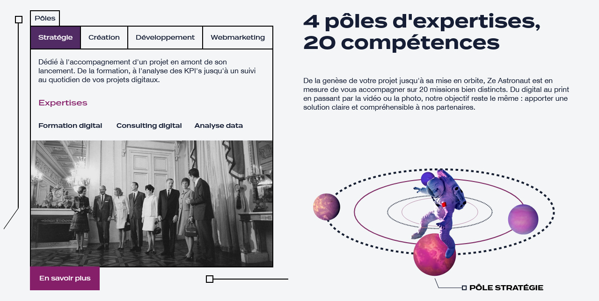

## Présentation de l'agence

Ze&nbsp;Astronaut est une agence de communication basée sur Paris, travaillant sur tout ce qui a trait à la communication de marques et d'entreprises sur les réseaux sociaux et dans le monde réel.

Suite à notre première collaboration pour la [création du site internet des restaurants Boosh-B](/projet/boosh-b), l'agence a choisi de faire appel à mes services pour l'**intégration des maquettes** de leur nouveau site Web.

## Programme de la mission

De même que pour le site des restaurants Boosh-B, la maintenance du site ne nécessite pas un système de gestion de contenu, j'ai choisi d'utiliser *Astro*[^1], un **générateur de sites statiques**.

La charte graphique de l'agence Ze&nbsp;Astronaut est orientée sur l'espace, avec des éléments décoratifs comme des fusées ou des planètes ci et là, ainsi que des photographies ou des références historiques.

### Animations et interactions

L'agence souhaite dynamiser visuellement son site Web avec des animations d'apparitions du contenu sur la quasi-totalité des pages, ainsi que de l'interactivité sur un élément de la page d'accueil.


*Sur la page d'accueil du site, le bloc des expertises comporte quatre onglets, faisant tourner la galaxie et l'astronaute lors du clic sur un pôle d'expertise.*

L'animation principale est sur la présentation des pôles d'expertises de la page d'accueil. Une galaxie réalisée en SVG (un format d'image vectoriel) s'anime lorsque l'utilisateur sélectionne un pôle différent, en tournant l'astronaute et les planètes autour.

### Fonctionnalités CSS modernes

Le CSS est un langage permettant de styliser le HTML, et il continue d'évoluer avec de nouvelles fonctionnalités en permanence. Pour le site de Ze&nbsp;Astronaut, j'ai utilisé des propriétés récentes, mais avec une bonne compatibilité sur les navigateurs, comme `inset: 0;` pour remplacer `top: 0; left: 0; right: 0; bottom: 0;`, ou encore `aspect-ratio` permettant d'indiquer un ratio entre la largeur et la hauteur d'un élément.

#### Arrières-plans adaptatifs

Les pages de présentation des projets comportent toutes une bannière, verticale sur smartphone, et horizontale sur les autres écrans. Pour afficher une image de bonne qualité, adaptée à la résolution de l'écran, mais avec une taille de fichier raisonnable, j'ai opté pour la propriété CSS `image-set`.

Cette propriété permet de fournir plusieurs images en indiquant la résolution (`1x`, `2x`) ou différent formats de fichier (`type("image/webp")`, `type("image/avif")`), tout en laissant le navigateur choisir ce qui lui semble le plus adapté.

```sass
.page_project__header {
  background-image: url('/images/project/club-alliance-voyages/banner-mobile-720.webp'); // fallback
  background-image: image-set(
    url('/images/project/club-alliance-voyages/banner-mobile-720.webp') 1x,
    url('/images/project/club-alliance-voyages/banner-mobile-1080.webp') 2x
  );
}
/* bigger screens */
@media (min-width: 62em) {
  .page_project__header {
    background-image: url('/images/project/club-alliance-voyages/banner-1920.webp'); // fallback
    background-image: image-set(
      url('/images/project/club-alliance-voyages/banner-1920.webp') 1x,
      url('/images/project/club-alliance-voyages/banner-2560.webp') 2x
    );
  }
}
```

*Extrait du code source de la feuille de style des projets, pour proposer plusieurs tailles de l'image d'arrière plan, selon la résolution de l'écran.*

[^1]: Plus d'informations sur Astro : <a href="https://astro.build/" rel="noopener noreferrer nofollow" target="_blank">astro.build</a>
