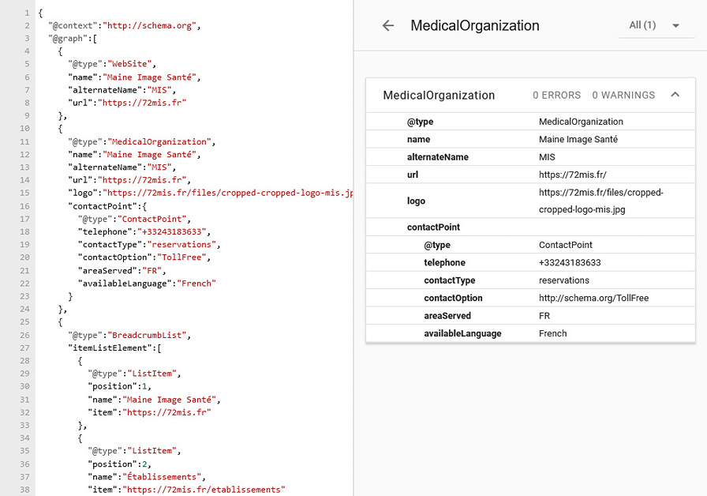

## Présentation du groupe

**Ce projet a été réalisé dans le cadre de mon alternance de deuxième année de DUT MMI, en 2018.**

Maine Image Santé est une société de radiologie et d'imagerie médicale, qui pratique des examens dans neuf centres et services d'imagerie, au Mans et en Sarthe (72).

Lors de ma seconde année de DUT MMI, j'ai effectué mon alternance chez eux en tant que Développeur Web. Ma mission principale était de **créer le nouveau site internet**.

## Besoins des patiens …

Ce site institutionnel devait répondre à plusieurs attentes des patients :

* Localiser les établissements du groupe, en indiquant les horaires, les modalités de prise de rendez-vous, et les accès en transports en commun
* Expliquer le déroulé des examens afin de rassurer les patients, et illustrer avec des photographies réalisées dans les salles d'examen
* Permettre la demande de rendez-vous en ligne grâce à un formulaire personnalisé et dynamique

### … et du personnel

En tant que commanditaires, les membres du comité de pilotage (COPIL) du projet ont émis plusieurs demandes :

* Pouvoir mettre à jour le contenu simplement, grâce à une interface d'administration
* Avoir la main sur les formulaires de demande de rendez-vous en ligne
* Gérer l'hébergement du site sur un de leurs serveurs, afin de ne pas dépendre d'un service tiers
* Respecter le RGPD pour le traitement des données sensibles des patients

## Solutions mises en oeuvre

Puisqu'il s'agissait de mon premier site d'envergure, j'ai commencé par analyser les **solutions de système de gestion de contenu (CMS)** disponibles, et qui soient à la portée d'un jeune développeur Web.

### Site WordPress avec thème personnalisé

J'ai choisi d'utiliser le CMS WordPress pour la **simplicité de la gestion du contenu**, ainsi que pour le grand nombre de formations disponible à son sujet.

Après avoir réalisé des croquis et des maquettes sur Affinity Designer, j'ai commencé l'intégration de gabarits des principales pages du site (page établissement, page examen, page formulaire ...).

### Champs conditionnels pour Contact Form 7

*Contact Form 7* est une extension WordPress populaire pour la réalisation de formulaire de contact, mais elle permet également de construire des formulaires complexes.

Couplé à l'extension *Conditionnal Fields for Contact Form 7*, les formulaires deviennent dynamiques, affichant ou masquant des champs et des options selon les réponses du patient.

Enfin, l'extension *Multi Step for Contact Form 7* indique au patient sa progression dans le formulaire de demande de rendez-vous.

### Performances boostées et référencement enrichi

**Optimiser les ressources** nécessaires au fonctionnement du site est **un point clé pour réduire le temps de chargement et améliorer la navigation** des utilisateurs. Pour cela, le site WordPress utilise uniquement les extensions indispensables, et **le thème a été développé pour répondre aux besoins spécifiques du site Web**.

Pour améliorer le référencement, le thème intègre la **génération automatique de données structurées**, un format de données utilisé par Google Search ou d'autres services pour comprendre le contenu du site, et faire le lien avec des plateformes comme Google Maps.

*Analyse des données structurées via Schema.org.*

## Conclusion

Cette première expérience professionnelle était aussi ma première expérience de **conception d'un site internet, de la rédaction du cahier des charges au développement et à l'optimisation, jusqu'à la mise en ligne.**

Réalisé avec WordPress, ce site est consulté par plus de 30.000 visiteurs par mois.
