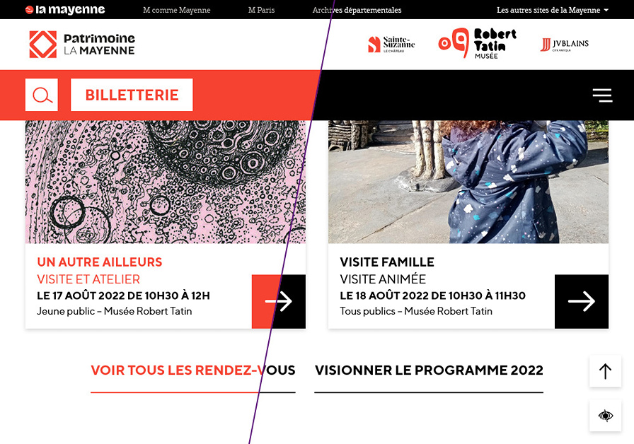

## Le projet

Le **Conseil départemental de la Mayenne** souhaitait regrouper et uniformiser les sites internet du Château de Sainte-Suzanne, du Musée de Jublains et du Musée Robert Tatin grâce à un nouveau site unique.

C'est un ami et collègue, [Paul Roger &ndash;&nbsp;développeur Web free-lance sur Laval](https://paulrogerdev.fr) également&nbsp;&ndash;, qui a obtenu le marché pour la création de ce site.

Je suis intervenu à la fin du projet pour travailler sur l'**accessibilité du site** aux lecteurs d'écrans, la navigation au clavier, et le fonctionnement des différents formulaires.

## Solutions mises en place

Le site fonctionne avec WordPress pour permettre la gestion du contenu aux administrateurs des musées et château. Les pages utilisent l'éditeur Gutenberg et des blocs personnalisés gérés avec *Advanced Custom Fields PRO (ACF)*.

Ma première tâche consistait à **améliorer la sémantique** utilisée sur chacun des blocs, afin d'indiquer aux lecteurs d'écrans les types de contenus adéquats, puis j'ai travaillé sur le fonctionnement des menus et autres contenus interactifs comme les formulaires de recherche.

### Menus de navigation

Plusieurs menus de navigation sont présents sur le site :

* Navigation vers les autres sites du département de la Mayenne
* Navigation entre les différents musées et château du patrimoine de la Mayenne
* Navigation interne pour chacun des musées et château

Ces trois menus ont chacun un affichage différent en fonction de la taille de l'écran, j'ai adapté le **fonctionnement pour la navigation au clavier et les lecteurs d'écrans**, en ajoutant des **attributs ARIA** (*Accessible Rich Internet Applications*, traduisible par "applications internet riches et accessibles") adaptés.

### Réglages d'accessibilité

Pour permettre une meilleure lisibilité, deux options sont disponibles pour l'utilisateur via un menu intitulé "Réglages d'accessibilité", mais également depuis les préférences du système ou du navigateur.

Sur les navigateurs les plus récents, des "requêtes média" (ou *media queries*) permettent de connaître ces préférences, telles que `@media (prefers-reduced-motion: reduce) {...}` pour un affichage avec moins d'animation graphiques.

#### Mode haut contraste

L'**accentuation du contraste rend le texte plus lisible**, notamment en remplaçant la couleur principale par du noir, et en retirant les nuances de gris sur les textes.

*Affichage par défaut à gauche, et avec contraste accentué à droite.*

Ainsi, tous les contenus ont un ratio de contraste d'au moins 7:1, ce qui est supérieur aux critères `3.2` et `3.3` du **Référentiel Général d'Amélioration de l'Accessibilité (RGAA)**.

#### Désactivation des animations graphiques

Plusieurs éléments du site comportent des animations, en particulier la page principale, ainsi que les menus. Selon les préférences de l'utilisateur, ces animations peuvent être désactivées afin de ne pas gêner la navigation des utilisateurs sensibles.

### Optimisation des performances

Le site nécessite l'utilisation de JavaScript pour s'adapter sur toutes les tailles d'écrans, j'ai profité des modifications des menus pour simplifier et optimiser le code utilisé afin de gagner en performances, et **réduire le *Cumulative Layout Shift* (CLS) lors du chargement** des évènements sur la page principale.
