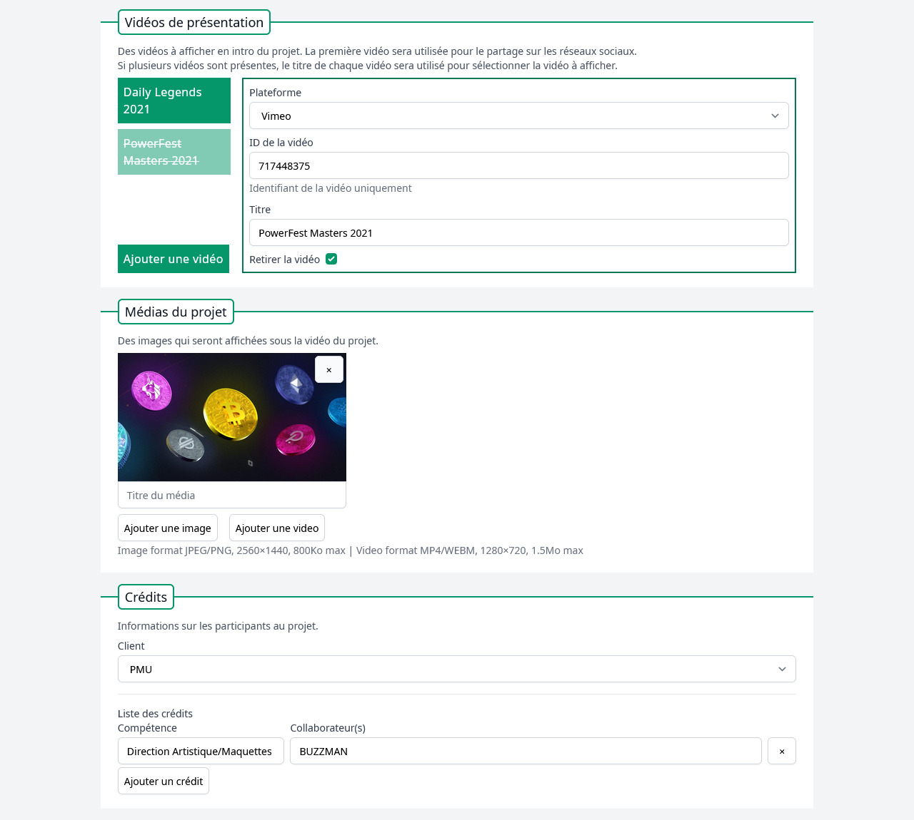
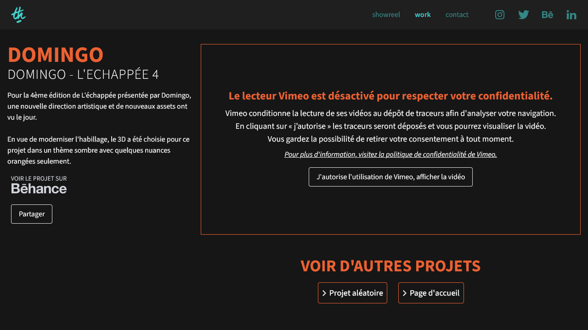

## Le projet

Après avoir réalisé une première version de son portfolio en 2017, Thommy a de nouveau fait appel à moi pour la **refonte de son portfolio**.
Il souhaitait conserver la grille de projets sur la page d'accueil, mais enrichir l'affichage des pages projets, et simplifier le formulaire de contact.

## Besoins et demandes du client

Comme sur la première version de son portfolio, Thommy voulait gérer lui-même l'ajout et la mise à jour des projets, avec un **Système de Gestion de Contenu** (SGC, ou en anglais *Content Management System &ndash; CMS*).

Les nouveautés principales sont sur les pages des projets, avec l'ajout des crédits pour citer les artistes ayant collaboré, la possibilité d'avoir plusieurs vidéos Vimeo sur un même projet, et un lien vers le projet sur Behance.

## Solutions mises en place

### Système de Gestion de Contenu

Pour les projets, Thommy m'a indiqué toutes les informations qu'il souhaitait présenter sur ses projets, et j'ai créé des formulaires dynamiques pour répondre à sa demande. Ainsi, chaque projet est personnalisable grâce à de nombreuses options :

* Titre et description du projet
* Couleurs principale et secondaire
* Lien vers la page Behance
* Miniature et aperçu vidéo pour la page d'accueil
* Vidéos de présentation sur Vimeo
* Images et vidéos du projet
* Crédits avec compétences et noms des collaborateurs
* Programmation de la date de publication

*Gestion des vidéos, des médias et des crédits sur la page d'édition d'un projet.*

D'autres contenus sont gérés via le CMS, tels que les showreels de Thommy, et les pages (mentions légales, politique de confidentialité).

### Optimisations des performances

Ce projet était l'occasion pour moi de **travailler sur des optimisations de performances côté client**. Le travail de Thommy étant majoritairement graphique, les pages projets comportent de nombreuses images et vidéos.

#### Redimensionnement des images à la mise en ligne

Lors de l'ajout d'une image à un projet, **le serveur va redimensionner l'image** dans 10 tailles différentes, et créer une copie de chaque image en *WEBP*, un format de fichier optimisé pour le Web.

À l'affichage du projet sur l'écran de l'utilisateur, les différentes tailles et formats sont proposés au navigateur, et celui-ci va télécharger **l'image la plus adaptée selon les caractéristiques de l'écran, telles que la taille et la résolution**.

#### Chargement asynchrone des vidéos

Sur la page d'accueil et sur les pages projets, les vidéos sont chargées dès lors qu'elles sont dans la partie visible de l'écran du navigateur de l'utilisateur. Ainsi, **seules les vidéos qui vont être affichées sont téléchargées**, réduisant le temps de chargement initial de la page.

### Lecteur Vimeo aux normes RGPD

Les vidéos des projets sont mises en lignes sur Vimeo, un service d'hébergement de vidéos alternatif à YouTube. **Comme tous les services tiers non essentiels, le consentement de l'utilisateur doit être recueilli** avant l'utilisation de celui-ci.

Lors du premier affichage d'une vidéo Vimeo, **l'utilisateur est averti de l'utilisation d'un service tiers**, et son consentement est demandé. Tant que l'utilisateur n'a pas donné son accord, le message sera affiché à la place de toutes les vidéos Vimeo du site.

*Page d'un projet avec une vidéo Vimeo, où l'utilisateur doit donner son consentement pour charger le service tiers*

Enfin, l'intégration du lecteur Vimeo traditionnel a été remplacée par LiteVimeoEmbed[^1], un lecteur qui charge les ressources de Vimeo uniquement si l'utilisateur intéragit avec la vidéo.

[^1]: LiteVimeoEmbed : <a href="https://github.com/slightlyoff/lite-vimeo" rel="noopener noreferrer nofollow" target="_blank">github.com/slightlyoff/lite-vimeo</a>
