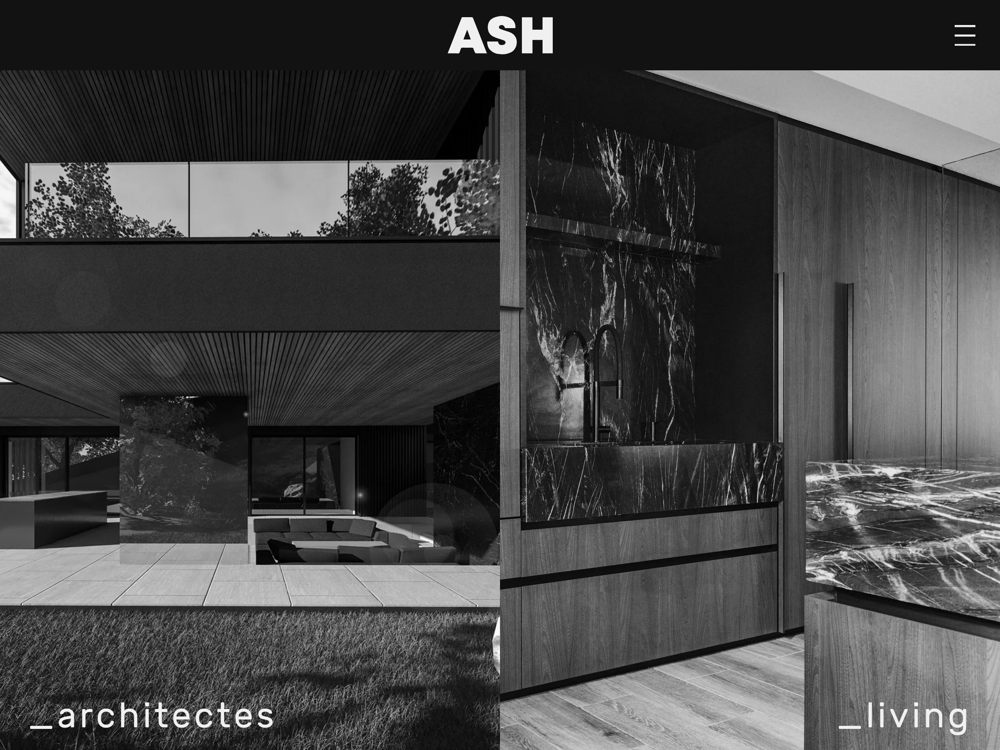
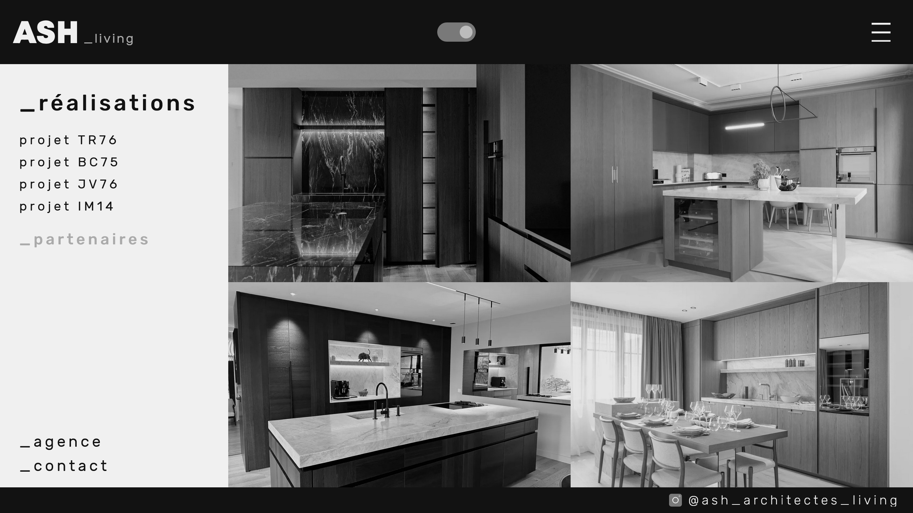

## Le projet

L'agence de communication Ze Astronaut[^1] accompagne ASH Architectes dans la refonte de leur site internet et la fusion de leurs deux identités : ASH Architectes &ndash; pour l'architecture, et ASH Living &ndash; pour l'agencement intérieur.

Pour réaliser ce nouveau site internet, Ze Astronaut m'a contacté pour que je réalise l'**intégration des maquettes** qu'ils ont auparavant réalisées sur *Adobe XD*.

## Le site internet

Le site est axé sur la présentation des projets réalisés, avec deux univers distincts : l'architecture et l'agencement intérieur.

Le contenu du site n'est pas amené à changer fréquemment, j'ai opté pour l'utilisation de Astro[^2], un outil permetant la gestion de contenus et qui **génère des pages statiques en HTML lors de la compilation**, idéal pour améliorer les performances et le temps de chargement du site, mais également réduire le coût et l'empreinte de l'hébergement.

### Intégration des maquettes

Le client souhaitait un site épuré visuellement, en privilégiant les images et les textures des projets. Toutes les images du site sont en noir et blanc, et apparaissent en couleurs lors du survol avec la souris sur ordinateur ou au clic sur téléphone.

*Le choix entre les deux univers se fait en cliquant sur une des deux images*

À partir des maquettes présentées par Ze Astronaut, j'ai réalisé l'intégration *responsive* &ndash; la déclinaison des maquettes ordinateurs vers le format tablettes et téléphone.

### Création de composants

Hormis les 3 pages de contenus pour la présentation de l'agence, de l'équipe, et le formulaire de contact, toutes les autres pages sont dédies aux projets de l'agence. La navigation sur le site se fait selon trois niveaux :

1. La page d'accueil oriente entre l'univers de l'architecture et l'agencement intérieur ;
2. Une page de présentation de l'univers met en avant certains projets avec un défilement vertical ainsi que les domaines de réalisation ;
3. Une page d'atterrissage présente la navigation des domaines de réalisation et la liste des différents projets du domaine sélectionné.

*La navigation entre les domaines de réalisation à gauche de l'écran et la liste des projets sous forme de vignettes*

La navigation entre les deux univers se fait à l'aide d'un bouton type "toggle" dans le menu d'entête de la page.

À l'aide de composants communs aux deux univers du site, ces pages sont générées automatiquement selon les informations des projets.

Les contenus des projets sont stockés dans des Collections de Contenus[^3], un format proposé par l'outil Astro. Chaque projet correspond à un fichier *MarkDown* avec un titre, une description, la liste des images, etc. Puis les composants récupèrent ces informations pour générer le contenu des pages automatiquement à la compilation du projet.

Les données stockées dans les Collections de Contenus peuvent être déplacées vers d'autres **Systèmes de Gestion de Contenus**, tels que Strapi, Directus, ou même WordPress.

[^1]: Site internet de l'agence Ze Astronaut : <a href="https://zeastronaut.com/" rel="noopener" target="_blank">zeastronaut.com</a>
[^2]: Plus d'informations sur Astro : <a href="https://astro.build/" rel="noopener noreferrer nofollow" target="_blank">astro.build</a>
